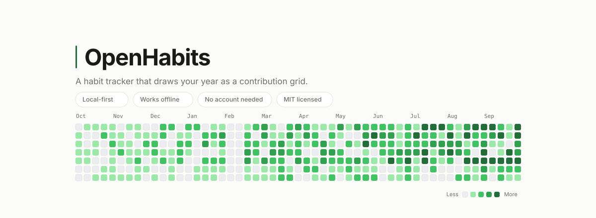
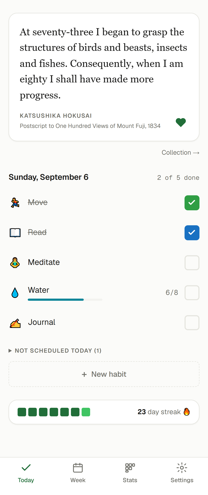
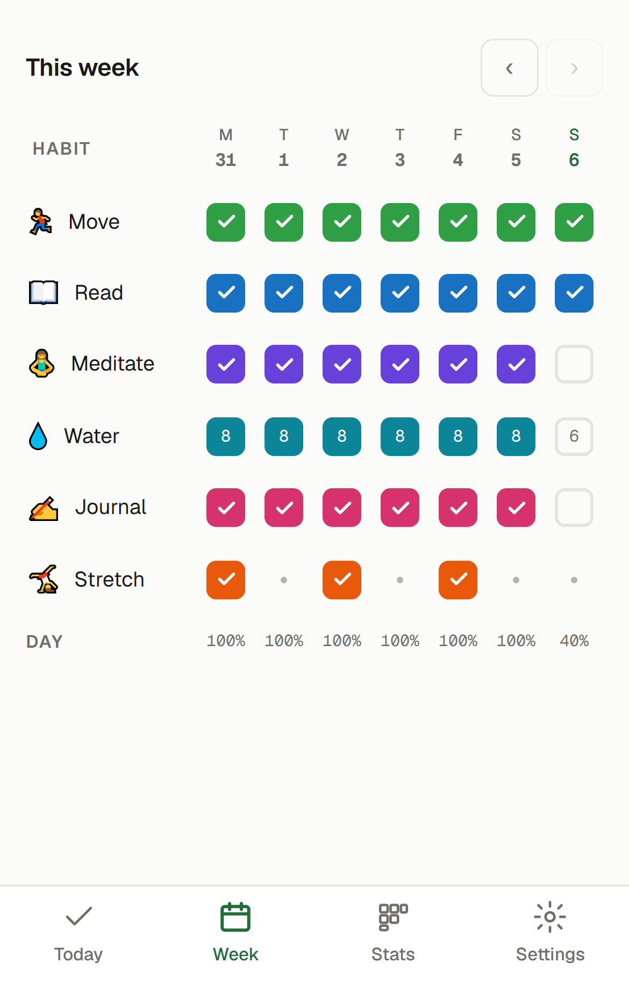
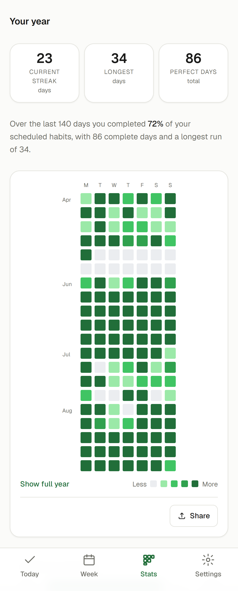
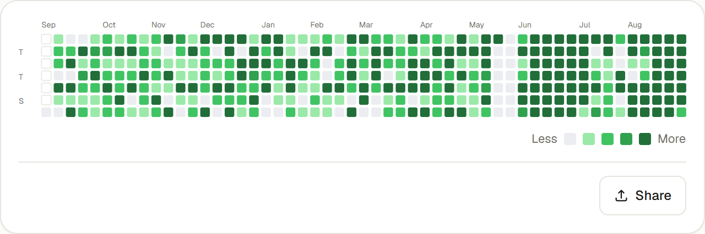
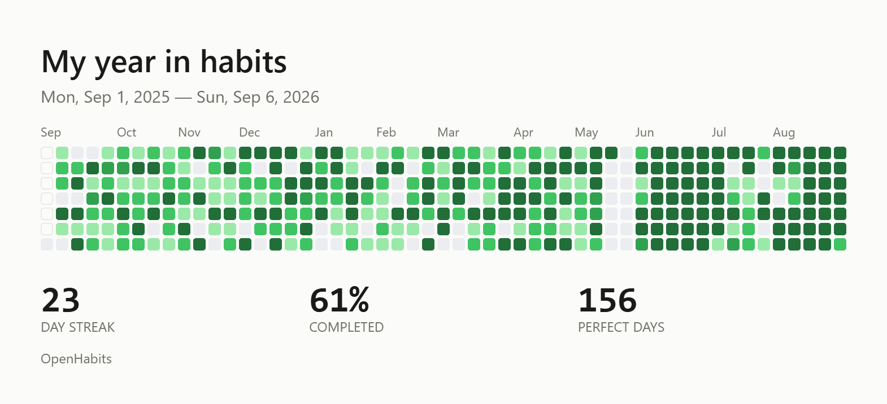
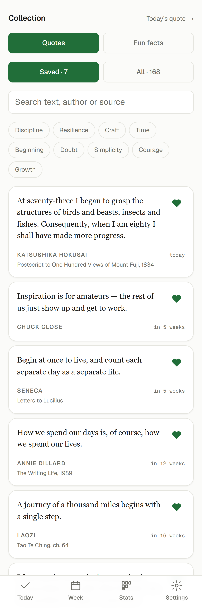
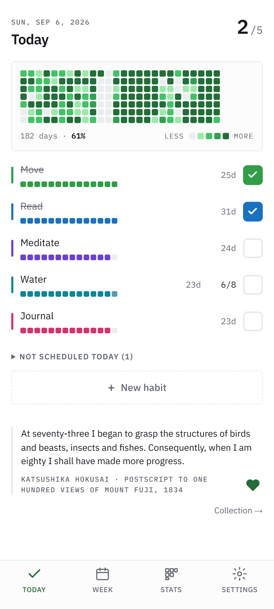
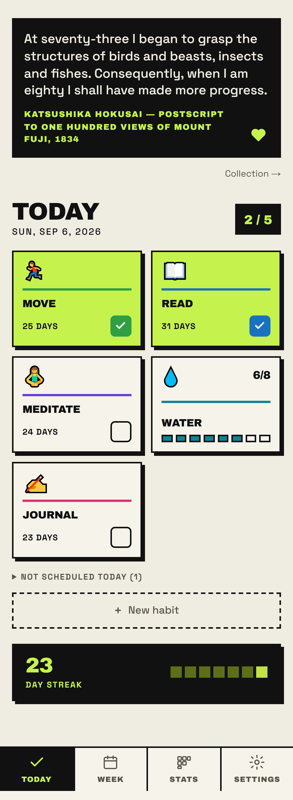
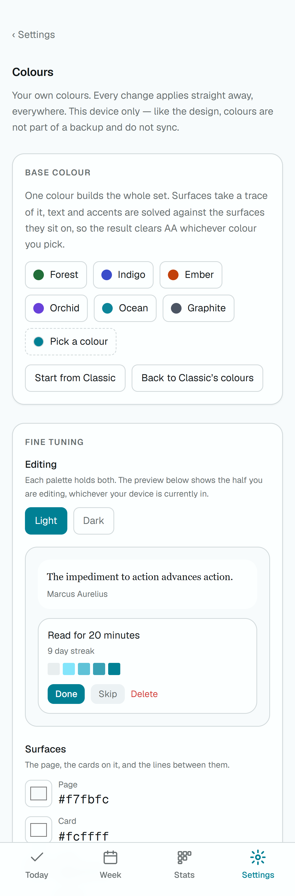

<div align="center">

<picture>
  <source media="(prefers-color-scheme: dark)" srcset="docs/media/banner-dark.svg">
  
</picture>

<br>

**A daily quote that earns its place, and a habit tracker that draws your year as a contribution grid.**

No account needed. Works offline. No spinner between you and a tick.

<br>


</div>

---

## Three screens, one habit loop

<table>
<tr>
<td width="33%" align="center" valign="middle">
<picture><source media="(prefers-color-scheme: dark)" srcset="docs/media/today-dark.png"></picture>
</td>
<td width="33%" align="center" valign="middle">
<picture><source media="(prefers-color-scheme: dark)" srcset="docs/media/week-dark.png"></picture>
</td>
<td width="33%" align="center" valign="middle">
<picture><source media="(prefers-color-scheme: dark)" srcset="docs/media/stats-dark.png"></picture>
</td>
</tr>
<tr>
<td align="center"><b>Today</b><br><sub>Read something good. Tap what you did.</sub></td>
<td align="center"><b>Week</b><br><sub>Backfill yesterday. Fix last Thursday.</sub></td>
<td align="center"><b>Stats</b><br><sub>A year of you, one square per day.</sub></td>
</tr>
</table>

<sub>Real screenshots, seeded with a year of demo data — see <code>scripts/screenshots/</code>.</sub>

---

## Why OpenHabits

Most habit apps make you wait: a tick posts to a server, a spinner appears, and a half-second habit becomes one you quit. **OpenHabits never waits.** Your data lives on your device, every page is static HTML, and a tick is saved before your finger lifts.

|  | |
|---|---|
| ⚡ **Instant ticks** | Every write is local and optimistic. The UI never waits on the network. |
| 📴 **Truly offline** | An installable PWA. Nothing is fetched to render your day. |
| 🔒 **Private by default** | No account, no telemetry, no third parties. Export everything as JSON. |
| 🟩 **Your year at a glance** | A contribution grid, streaks, perfect days, weekday and monthly trends. |
| 💬 **168 quotes, 85 facts** | Every one traceably sourced, or it doesn't ship. |
| 🎨 **Three skins, any palette** | Three layouts in light and dark, plus a custom palette from a single colour. |
| 🔔 **Reminders on your clock** | 9am means 9am where you are, not where the server is. |
| ☁️ **Sync if you want it** | Optional accounts. Skip them and you lose a second device, nothing else. |

---

## A year, one square per day

<picture>
  <source media="(prefers-color-scheme: dark)" srcset="docs/media/year-dark.png">
  
</picture>

Each square is a day, shaded by how much of it you finished. Rest days look different from missed ones, and a month with nothing scheduled stays empty instead of reading as zero.

Share the whole year as one image, drawn on a canvas in your browser from your own data:

<p align="center">
  
</p>

---

## A daily card that never repeats too soon

<table>
<tr>
<td width="42%" valign="top">
<picture><source media="(prefers-color-scheme: dark)" srcset="docs/media/collection-dark.png"></picture>
</td>
<td valign="top">

Most quote apps hash the date, which gets you repeats, gaps, and a different quote on your phone than on your laptop.

OpenHabits deals from a shuffled deck instead. **Every entry appears once per pass, nothing repeats within 21 days, and every device shows the same card, with no server involved.** Because the order is known in advance, the Collection screen can tell you when a saved quote comes round next: *in 5 weeks*, *in 12 weeks*.

Narrow it by tag, or swap quotes for fun facts with one setting. Both share one favourites list and meet the same sourcing bar. Filter down to nothing and you get the whole deck back, because the card is never empty.

</td>
</tr>
</table>

---

## Make it look like yours

A skin changes the **layout**, not just the colours. `grid` puts your year above the fold, and `blocks` trades soft edges for tiles you can hit without looking.

<table>
<tr>
<td width="33%" align="center" valign="middle">
<picture><source media="(prefers-color-scheme: dark)" srcset="docs/media/today-dark.png"></picture>
</td>
<td width="33%" align="center" valign="middle">
<picture><source media="(prefers-color-scheme: dark)" srcset="docs/media/skin-grid-dark.png"></picture>
</td>
<td width="33%" align="center" valign="middle">
<picture><source media="(prefers-color-scheme: dark)" srcset="docs/media/skin-blocks-dark.png"></picture>
</td>
</tr>
<tr>
<td align="center"><b><code>classic</code></b><br><sub>Cards, soft edges, one column.</sub></td>
<td align="center"><b><code>grid</code></b><br><sub>Your year up top, dense rows below.</sub></td>
<td align="center"><b><code>blocks</code></b><br><sub>Hard edges and big tiles.</sub></td>
</tr>
</table>

<table>
<tr>
<td width="40%" valign="top">
<picture><source media="(prefers-color-scheme: dark)" srcset="docs/media/palette-editor-dark.png"></picture>
</td>
<td valign="top">

**Pick one colour, get a whole palette.** `lib/palette.ts` derives all 20 tokens for light and dark from a single seed and checks that the result passes WCAG AA, whatever you pick.

Appearance is per device, so your phone can be dark `blocks` while your laptop stays light `classic`.

</td>
</tr>
</table>

---

## Quick start

```bash
npm install
npm run dev          # http://localhost:3000
```

Needs Node 24 (`.nvmrc`). **No environment variables are required.** With none set the app is fully functional, and the Account card explains that sync is off. To turn on accounts, sync or reminders, see **[`docs/DEPLOYMENT.md`](docs/DEPLOYMENT.md)** and `.env.example`.

---

## Accounts and sync: optional, and it stays that way

Sync copies your local store between devices. The server never becomes the owner of your data.

- **Self-hosted auth.** Email and password via Better Auth, on the same Postgres as your habits. Anything but a valid session gets a 401.
- **Conflicts converge.** The last write wins per record, and ties break on content, so two devices agree instead of trading values forever.
- **Signing in asks first.** On a device that already has habits, nothing uploads until you confirm they're yours. Neither answer deletes anything.
- **Row-level security on every table.** A query outside a user's scope reads nothing rather than everything.
- **Password reset.** One hour, one use, every session revoked, and the same reply whether or not the address has an account.

---

## Under the hood

**Next.js 16.3.1** (App Router) · **React 19.2** · **Tailwind CSS v4** · **TypeScript 5** · **Vitest**. Optional accounts and sync: **Better Auth** + **Postgres** + **Drizzle**, with **PGlite** (Postgres-in-WASM) for tests.

Every route prerenders to static HTML. The only dynamic routes (sync, auth, reminders and mail) never sit between you and a tick.

```
React client components
  → lib/store.ts        in-memory cache + useSyncExternalStore
  → lib/db.ts           IndexedDB, fire-and-forget writes
  ← lib/sync/client.ts  merges server state in later
```

The dependency runs one way: sync imports the store; the store knows nothing about sync.

| Route | Screen |
|---|---|
| `/` | **Today**: the daily card and today's habits |
| `/week` | **Week**: seven days × every habit; backfill and correct the past |
| `/stats` | **Stats**: heatmap, streaks, completion rates, share card |
| `/settings` | **Settings**: appearance, week start, habits, account, reminders, export/import |
| `/habit?id=` | **Habit detail**: one habit's heatmap, cadence, rename, archive, delete |
| `/quotes` | **Collection**: everything you saved, searchable by author, source and tag |

The first four are the bottom tab bar; the last two are pushed views.

<details>
<summary><b>Decisions worth knowing before you change anything</b></summary>

<br>

- **Mutations are synchronous and optimistic.** A habit tick that spins is a habit that dies.
- **Dates are local civil `YYYY-MM-DD` strings.** Only `lib/dates.ts` produces one, doing day maths in UTC-space so DST can't shift a boundary.
- **Derived data is never persisted.** `lib/history.ts` and `lib/streaks.ts` rebuild a year inside the frame budget, pinned by a benchmark test.
- **Nothing user- or date-dependent renders on the server.** The service worker caches static HTML, so browser-shaped UI is gated on a server snapshot that reports the hidden case.
- **`public/sw.js` must never cache `/api/`.** A cached session response tells a signed-out browser it is signed in, offline, where nothing corrects it.
- **A null completion rate means "nothing was scheduled"**, drawn as an empty track, and `weekdayExtremes` names no best or worst day on too little data.
- **Appearance never syncs.** A custom palette wins by being inline on `<html>`, so nothing else may write inline styles there.
- **Deletes write tombstones**, and their six-month TTL bounds *resurrection*, not storage.
- **Undo is one slot with a TTL**, and the store doesn't import it: `deleteHabit` returns what it removed and the caller decides.

`DESIGN.md` is authoritative and kept current; its section numbers (§7.1, §13.2, …) are referenced from module headers. Read the relevant section before changing anything in `lib/`.

</details>

### Commands

```bash
npm run dev              # next dev
npm run build            # next build
npm start                # next start (use for Lighthouse / perf checks)
npm run lint             # eslint (flat config)
npm run typecheck        # tsc --noEmit
npm test                 # vitest run
npm run test:watch

npm run media            # regenerate the README banner in docs/media/
npm run icons            # regenerate public/icon-*.png + app/apple-icon.png
npm run db:generate      # drizzle-kit generate — write a migration
npm run db:migrate       # drizzle-kit migrate — apply committed migrations
npm run db:studio

npx vitest run tests/sync/merge.test.ts     # one file
npx vitest run -t "takes the later write"   # one case
```

### Tests

**353 tests across 28 files**, all logic: no jsdom, no component or E2E tests. They mirror the `lib/` tree (`lib/sync/merge.ts` → `tests/sync/merge.test.ts`). Server tests boot a real Postgres in-process (PGlite) and apply the committed migrations verbatim, because the delicate parts of sync live in SQL and a test double would check none of them. `tests/server/rls.test.ts` runs as a non-superuser, since a superuser passes every RLS test ever written. `lib/db.ts` is deliberately untested: faking IndexedDB would add the dependency that module was hand-rolled to avoid.

---

## Contributing

Start with **[`CONTRIBUTING.md`](.github/CONTRIBUTING.md)**. `ROADMAP.md` orders the open questions and marks which are settled decisions, so check it before "fixing" something that was decided deliberately.

By taking part you agree to the [Code of Conduct](.github/CODE_OF_CONDUCT.md). Report security vulnerabilities through [`SECURITY.md`](.github/SECURITY.md), never a public issue.

## License

MIT © [chongjie-6](https://github.com/chongjie-6)
